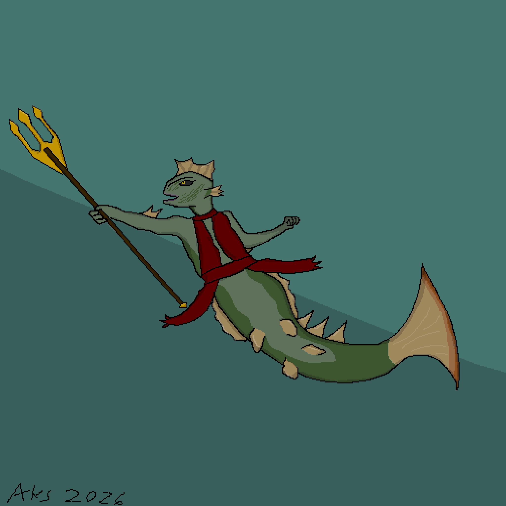
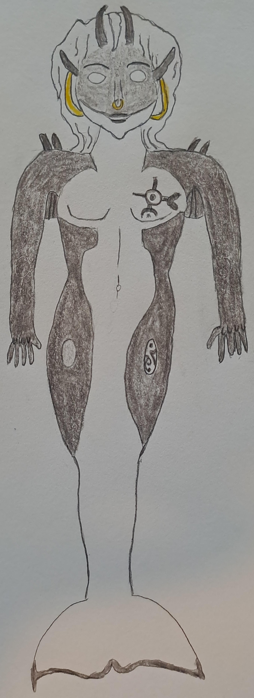

+++
title = "Art Fight 2026"
date = 2026-08-02
[taxonomies]
characters = ["Aava", "Miriel", "Salma", "Ivu"]
[extra]
license = "Multiple"
container_classes = "gallery-container"
main_image = "thumbnail.jpg"
main_image_alt = """A grid of four different cropped thumbnails of artwork in ink and gouache."""
skip_main_image = true
enable_webmentions = false
mastodon_url = ""
+++

My second year on [ArtFight], great fun once again!
If you don't know what that is, I described it in [last year's post][af2025].
This time I went full traditional, working in ink and gouache.

<!-- more -->

I've posted everything I've got permission to share here,
which is almost but not quite all of them.
You can also browse all the works on [my profile] if you have an ArtFight account.

License for the images is All rights reserved unless specified otherwise.

## Attacks

"Small coffee" featuring Mero for [vampirictecsie]

"Bouquet for the buds" featuring Willow for [Smox]

"Cabin in the valley" featuring Mirana for [KBDraws92].
License: [CC BY-NC-SA]

"Lizard guy doodle" featuring Huntra for [aks]

"No stage lights necessary" featuring Lady Inferno for [ghostcatte]

Väinö for [DigiPotato]

"Late for class" featuring Tessa the Alchemist for [Pixalisk]

"Bless up" featuring Blasphemy (aka Bless) for [DaQueen]

"Rosy" featuring The Starry-Eyed Poetess for [tiiny]

## Defenses

Aava by [KBDraws92], license: [CC BY-NC-SA]

"Warrior Princess of the Seas" featuring Aava by [aks]

"What's Cooking?" featuring Miriel by [Pixalisk]

Salma by [DigiPotato]

"Well Hello There" featuring Aava and [Green_tea_]'s Kytu Essaiyah by [DaQueen]

"Forest Keeper Ivu" by [ghostcatte]

[artfight]: https://artfight.net/
[af2025]: /gallery/2025/art-fight-2025/
[my profile]: https://artfight.net/~Molentum

[vampirictecsie]: https://artfight.net/~vampirictecsie
[smox]: https://blorbo.social/@smox
[aks]: https://scalie.zone/@aks
[green_tea_]: https://artfight.net/~Green_tea_
[daqueen]: https://artfight.net/~DaQueen
[kbdraws92]: https://bio.link/kbdraws92
[pixalisk]: https://mastodon.art/@Pixalisk
[digipotato]: https://artfight.net/~DigiPotato
[ghostcatte]: https://mastodon.art/@ghostcatte
[tiiny]: https://dona.neocities.org/

[CC BY-NC-SA]: https://creativecommons.org/licenses/by-nc-sa/4.0/
